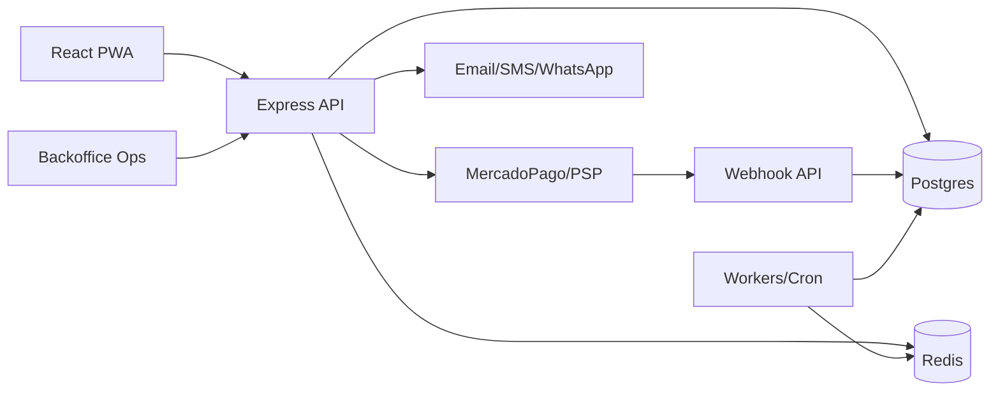

# Roadmap de Estacionate: de MVP a SaaS industry-grade

Fecha: 2026-04-27  
Repositorio: `cortega26/estacionate-mvp` (`/home/carlos/VS_Code_Projects/estacionate-mvp`)  
Branch analizada: `master`  
Commit analizado: `a90ad9d76eefdc3c3130714f520db42ca95f9d9d`  
Alcance: auditoria de producto, arquitectura, operacion, riesgos, seguridad, pagos, legal/comercial y roadmap. Sin cambios de codigo.  
Limitaciones: analisis legal no constituye asesoria juridica; requiere abogado chileno. Se reviso codigo local y documentacion; no se verifico produccion, analytics reales, contratos, datos comerciales ni cuentas de proveedores.

Nota de trazabilidad: al inicio de la auditoria HEAD era `99c342abfd960fb1895d2f9023b0273c05f68cad` con cambios locales en backend/admin/concierge/webhook y tests de observabilidad. Durante la sesion esos cambios quedaron committeados en `a90ad9d...`; el contenido analizado corresponde a ese estado final.

## 1. Resumen ejecutivo

Estacionate hoy es un MVP funcional para buscar disponibilidad, reservar estacionamientos de visita, iniciar pago, confirmar via webhook, cancelar con politica simple, operar un panel de conserjeria, administrar edificios/usuarios/precios y calcular conciliacion/payouts basicos. La evidencia principal esta en `backend/prisma/schema.prisma`, `backend/src/services/BookingService.ts`, `backend/src/services/PaymentService.ts`, `backend/src/api/concierge/*`, `backend/src/api/admin/*`, `frontend/src/pages/dashboard/SearchPage.tsx`, `frontend/src/pages/gatekeeper/Dashboard.tsx` y tests backend.

Debe llegar a ser una SaaS B2B2C para comunidades residenciales chilenas que reduzca conflictos mediante reglas configurables, autorizacion estricta por edificio, trazabilidad completa, conciliacion financiera auditable, soporte operacional y contratos prudentes. La brecha principal no es "falta dashboard"; es falta de modelo formal de tenancy, RBAC, workflow operacional completo, contratos/consentimientos versionados, estados fisicos de entrada/salida, gestion de incidentes/disputas y hardening financiero/legal.

Top 10 decisiones estrategicas:

| #   | Decision               | Recomendacion                                                                                                      |
| --- | ---------------------- | ------------------------------------------------------------------------------------------------------------------ |
| 1   | Tenant principal       | Edificio/comunidad como tenant operacional; administradora como agrupador multi-edificio.                          |
| 2   | Rol juridico           | Posicionar como proveedor SaaS/intermediario tecnologico; evitar custodiar fondos sin validacion legal/financiera. |
| 3   | Primer mercado         | Comunidades chilenas con conserjeria y escasez real de visitas, no estacionamientos publicos.                      |
| 4   | Producto vendible      | Orden, trazabilidad, reglas claras, reportes y conciliacion antes que features avanzadas.                          |
| 5   | Conserjeria            | Vista ultra simple, mobile-first, con busqueda por patente/codigo y modo contingencia.                             |
| 6   | Pagos                  | Mantener MercadoPago/simulador, formalizar estados, idempotencia, refunds, disputes y payouts.                     |
| 7   | Datos personales       | Minimizar RUT/patente/telefono; cifrado, blind index, retencion y export/eliminacion por tenant.                   |
| 8   | Arquitectura           | Monolito modular con Postgres, Redis/jobs, webhooks seguros y backoffice; no microservicios aun.                   |
| 9   | Piloto                 | 1-3 edificios con contrato piloto, reglas manualmente validadas y soporte cercano.                                 |
| 10  | Demostracion comercial | La demo debe mostrar menos discusiones: antes/despues, evidencia, reportes y conciliacion.                         |

Top 10 riesgos:

| #   | Riesgo                                                                    | Impacto              | Mitigacion prioritaria                                                          |
| --- | ------------------------------------------------------------------------- | -------------------- | ------------------------------------------------------------------------------- |
| 1   | Uso de estacionamientos de visita no permitido por reglamento/copropiedad | Legal/comercial alto | Validacion por edificio, contrato B2B y checklist legal.                        |
| 2   | Cross-tenant leakage                                                      | Critico              | Authorization backend-first y tests por tenant.                                 |
| 3   | Pago confirmado sin reserva valida o reserva sin pago                     | Alto                 | Maquina de estados, idempotency keys, conciliacion y alertas.                   |
| 4   | Conserje rechaza visita por app confusa/offline                           | Alto                 | Flujo de verificacion de 10 segundos, contingencia y entrenamiento.             |
| 5   | Plataforma percibida como responsable de robo/dano                        | Alto                 | Contratos, disclaimers prudentes, evidencia y delegacion operativa al edificio. |
| 6   | Payout/commission duplicado o incorrecto                                  | Alto                 | Ledger financiero, estados tipados, constraints y aprobacion dual.              |
| 7   | Resident/Usuario interno ambiguos                                         | Alto                 | ADR y modelo de identidad/cuentas formal.                                       |
| 8   | Datos personales tratados sin base/consentimiento claro                   | Alto                 | Politica privacidad, terms acceptance versionado y minimizacion.                |
| 9   | Tests DB no aislados para ejecucion paralela                              | Medio                | DB/schema por worker o serializar integracion.                                  |
| 10  | Pricing/ingresos prometidos sin volumen real                              | Medio                | Pilotos con metricas y pricing conservador.                                     |

Top 10 mejoras de mayor impacto:

| #   | Mejora                        | Problema                         | Criterio de aceptacion                                                             |
| --- | ----------------------------- | -------------------------------- | ---------------------------------------------------------------------------------- |
| 1   | ADR tenancy + RBAC            | Permisos implicitos              | Cada endpoint valida scope y rol con tests negativos.                              |
| 2   | Estado operacional de reserva | No hay check-in/out fisico       | Booking distingue `confirmed`, `checked_in`, `checked_out`, `overstay`, `no_show`. |
| 3   | Ledger financiero             | Payouts simples                  | Cada booking/pago/refund/payout tiene movimiento auditable.                        |
| 4   | Versionado legal              | T&C estatico                     | `LegalDocumentVersion` y `TermsAcceptance` por usuario/edificio.                   |
| 5   | Incident/dispute module       | Reclamos por dano, cobro, acceso | Incidente con evidencia, owner, SLA y resolucion.                                  |
| 6   | Backoffice soporte            | Soporte no modelado              | Operador puede buscar por booking/patente/email con auditoria.                     |
| 7   | Onboarding edificio           | Seed/demo manual                 | Alta repetible con unidades, cupos, reglas y usuarios internos.                    |
| 8   | Data retention/export         | No hay baja legal                | Export tenant y anonimizacion probada.                                             |
| 9   | Observabilidad producto/pagos | Logs existen, no dashboards      | Alertas para webhooks, pending expirados, payout mismatch.                         |
| 10  | Demo mode                     | Demo parcial por seed            | Demo aislada, reseteable, sin mezclar produccion.                                  |

No hacer todavia: app nativa, IoT/barreras, microservicios, AI decisoria, marketplace abierto de terceros, pricing ultradinamico, integraciones contables profundas, control de acceso fisico, programa de partners masivo, financiamiento/custodia propia de fondos, automatizar decisiones legales del edificio.

## 2. Inventario del estado actual

| Area           | Estado actual                                                                                                                                  | Evidencia                                                                    | Riesgo                                                                                         | Recomendacion                                               |
| -------------- | ---------------------------------------------------------------------------------------------------------------------------------------------- | ---------------------------------------------------------------------------- | ---------------------------------------------------------------------------------------------- | ----------------------------------------------------------- |
| Stack          | React/Vite/TS/Tailwind, Express/TS/Prisma/Postgres, Redis, Docker, Vitest/Playwright                                                           | `README.md`, `package.json`, `backend/package.json`, `frontend/package.json` | Stack viable pero Vercel serverless + jobs puede limitar conciliacion                          | Mantener monolito modular; formalizar staging/prod y jobs.  |
| Modelo datos   | Building, Unit, Resident, VisitorSpot, AvailabilityBlock, Booking, Payment, Payout, User, AuditLog, Blocklist, PricingRule, SalesRepCommission | `backend/prisma/schema.prisma`                                               | Falta UnitResident roles, refund/dispute/ticket/legal docs/webhooks persistidos                | Expandir schema por fases con ADRs.                         |
| Roles actuales | `admin`, `support`, `building_admin`, `concierge`, `sales_rep`; residente separado                                                             | `Role` enum, `Resident` model                                                | No hay Super Admin separado, auditor, finance, legal, committee; Resident no es User           | Definir identity model y RBAC formal.                       |
| Booking        | Reserva atomica de block disponible; previene doble booking; pending -> confirmed por webhook; cancel/completed/no_show enum                   | `BookingService.ts`, `MercadoPagoAdapter.ts`, tests                          | Sin check-in/out, extension, overstay, no-show automatizado                                    | Agregar state machine de dominio.                           |
| Pagos          | Payment 1:1, GatewayStatus, MercadoPago/simulador, refunds basicos                                                                             | `PaymentService.ts`, `payment/*`, tests                                      | `Payment.status` usa gateway enum y `Booking.paymentStatus` otro enum; no ledger               | Formalizar PaymentIntent, Refund, Ledger, WebhookEvent.     |
| Conciliacion   | Cron diario crea Payout por edificio y comision vendedor                                                                                       | `backend/src/api/cron/reconcile.ts`, `SalesService.ts`                       | Payout `status` string; base en bookings confirmed por createdAt                               | Usar ledger cash/accrual y periodos por timezone.           |
| Conserjeria    | Dashboard de reservas de hoy; verificacion por patente/codigo                                                                                  | `backend/src/api/concierge/*`, `frontend/src/pages/gatekeeper/Dashboard.tsx` | Sin registrar check-in/out ni evidencias                                                       | Convertir verificacion en evento operacional auditado.      |
| Admin          | Stats, analytics, buildings, users, bookings, prices                                                                                           | `backend/src/api/admin/*`, `frontend/src/pages/admin/*`                      | Acciones destructivas como force delete; RBAC grueso                                           | Archivar por defecto; eliminar solo demo con dual approval. |
| Seguridad      | JWT cookie httpOnly, bcrypt, CORS whitelist, Helmet, rate limit Redis, AES-GCM para RUT/telefono, rutHash                                      | `auth.ts`, `crypto.ts`, `cors.ts`, `app.ts`                                  | Sin MFA, CSRF formal, secrets rotation, DSR, tenant middleware unico                           | P0 security baseline antes de piloto real.                  |
| Auditoria      | `AuditLog` + `EventBus` ADR; booking create/cancel publica eventos                                                                             | `documentation/adr/0004...`, `event-bus.ts`                                  | Muchos writes no publican eventos; Redis failure no bloquea persistencia solo si publish local | Testear eventos obligatorios por write path.                |
| Tests          | 42 backend files, frontend Vitest, Playwright E2E                                                                                              | `backend/tests/**`, `frontend/e2e/**`                                        | DB compartida no soporta wrappers paralelos; E2E falla por browsers y login                    | Aislar DB por worker y arreglar E2E.                        |
| CI/CD          | CI frontend/backend/docs y CD Vercel                                                                                                           | `.github/workflows/*`, ADR 0003                                              | Backend CI no incluye Redis service; frontend CD no build/test antes deploy                    | Endurecer CI/CD con staging y smoke.                        |
| Docs           | AGENTS, CODEMAP, VALIDATION, ADRs, project context, T&C                                                                                        | `documentation/**`                                                           | `TECH_SPEC.md` simplificado/desactualizado vs schema real                                      | Actualizar tech spec y ADRs de dominio.                     |

Senales de madurez: bootstrap, Docker local, migraciones, tests de seguridad/concurrencia/pagos, EventBus ADR, CORS/Helmet, cifrado PII, comisiones/payouts iniciales.  
Senales de deuda: docs simplificados, RBAC implicito, estados financieros/operacionales incompletos, tests dependientes de DB compartida, E2E roto, generated reports trackeados, terms sin acceptance versionado.

## 3. Inconsistencias y conflictos internos del diseno actual

| Inconsistencia                                        | Ubicacion                                                                                                                              | Impacto                                  | Riesgo | Decision recomendada                                                                                              |
| ----------------------------------------------------- | -------------------------------------------------------------------------------------------------------------------------------------- | ---------------------------------------- | ------ | ----------------------------------------------------------------------------------------------------------------- |
| Roles doc vs schema                                   | `TECH_SPEC.md` dice ADMIN/RESIDENT/GUARD; schema usa `admin/support/building_admin/concierge/sales_rep`; frontend usa `resident`       | Confusion de permisos                    | Alto   | ADR RBAC y actualizar `TECH_SPEC.md`.                                                                             |
| Resident separado de User                             | `Resident` y `User` modelos; login busca ambos                                                                                         | Identidad duplicada                      | Alto   | Mantener separacion solo si `ResidentAccount` y `InternalUser` quedan documentados; si no, unificar con perfiles. |
| PaymentStatus duplicado                               | `Booking.paymentStatus` enum pending/paid/failed/refunded; `Payment.status` GatewayStatus pending/approved/rejected/cancelled/refunded | Estados inconsistentes                   | Alto   | Crear state machine y mapping gateway -> dominio.                                                                 |
| T&C prometen 24h menos comision; codigo reembolsa 90% | `documentation/TERMINOS...`, `BookingService.cancelBooking`                                                                            | Reclamos legales/financieros             | Alto   | Una unica `CancellationPolicy` configurable/versionada.                                                           |
| Availability permite overlaps en DB                   | `repro-schema-issues.test.ts` confirma que se permiten                                                                                 | Doble disponibilidad                     | Alto   | Exclusion constraint Postgres o generacion serializada + tests.                                                   |
| QR documentado pero no real                           | `TECH_SPEC.md` habla QR; UI verifica codigo/patente; no entidad QR                                                                     | Seguridad operacional                    | Medio  | QR/token de acceso con uso/expiracion y logs.                                                                     |
| Delete edificio borra historia con `force`            | `admin/buildings.ts`, UI force delete                                                                                                  | Riesgo legal/auditoria                   | Alto   | Archivar; hard delete solo demo; retencion obligatoria.                                                           |
| PricingRule existe pero UI de prices actualiza blocks | `PricingRule`, `admin/prices.ts`                                                                                                       | Pricing no auditable                     | Medio  | Pricing rules formales con vigencia/aprobacion.                                                                   |
| Payout status string                                  | `Payout.status String`                                                                                                                 | Estados libres                           | Medio  | Enum `calculated/approved/paid/failed/disputed/void`.                                                             |
| Conserjeria no muta estado                            | `concierge/verify.ts` solo consulta                                                                                                    | No hay prueba de entrada                 | Alto   | `AccessEvent` + `checked_in/checked_out`.                                                                         |
| Cron sin auth robusta                                 | `cron/*.ts` comentarios sobre secret                                                                                                   | Ataque/ejecucion accidental              | Alto   | CRON_SECRET obligatorio y allowlist.                                                                              |
| Search edificios publico                              | `/buildings` sin auth                                                                                                                  | Exposicion comercial/operacional         | Medio  | Publicar solo edificios piloto/demo o requerir auth.                                                              |
| API client credentials mal ubicado                    | `frontend/src/lib/api.ts` pone `withCredentials` dentro headers                                                                        | Cookies pueden no enviarse como esperado | Medio  | Configurar `withCredentials: true` a nivel axios root.                                                            |
| E2E login falla                                       | `frontend/e2e/*` validacion                                                                                                            | No hay smoke browser confiable           | Alto   | Seed/preflight E2E y browsers instalados en CI.                                                                   |

## 4. Modelo de producto SaaS objetivo

Segmentos objetivo: edificios residenciales con conserjeria y escasez de cupos; administradoras con cartera de edificios; comites que buscan orden e ingresos; edificios en zonas con estacionamiento callejero caro/restringido. Usuarios principales: administrador, conserje, residente, visita. Secundarios: comite, soporte Estacionate, finanzas, vendedor, auditor externo.

Jobs-to-be-done:

| Stakeholder    | Dolor                                          | Propuesta de valor                                      |
| -------------- | ---------------------------------------------- | ------------------------------------------------------- |
| Administradora | Reclamos, reglas informales, reportes manuales | Reglas configuradas, historial, reportes y menor carga. |
| Comite         | Quiere control sin operar el dia a dia         | Dashboard read-only, ingresos, evidencias.              |
| Conserje       | Debe decidir rapido en porteria                | Lista clara, patente/codigo, semaforo y contingencia.   |
| Residente      | Quiere asegurar cupo sin discutir              | Reserva pagada, reglas claras, estado visible.          |
| Visita         | Quiere entrar sin friccion                     | Codigo/patente e instrucciones simples.                 |
| Estacionate    | Debe evitar ser juez operativo                 | Trazabilidad, roles, contratos, delegacion al edificio. |

Feature set minimo vendible: onboarding edificio, unidades/residentes verificados, cupos y disponibilidad, reglas de precio/cancelacion simples, reserva/pago/confirmacion, conserjeria por patente/codigo, cancelacion/refund basico, dashboard edificio, conciliacion mensual, audit log, soporte manual, T&C/politica privacidad aceptados.

Industry-grade: RBAC completo, tenancy robusto, ledger financiero, payouts aprobables, refunds/disputes, incidents, check-in/out, overstay/no-show, blocklist granular, legal docs versionados, data export/anonymization, observabilidad, runbooks, SLA, feature flags, staging/prod, backoffice.

Diferidos: app nativa, integracion barreras/camaras, pricing predictivo, marketplace abierto, APIs externas, AI-assisted soporte, expansion regional.

Respuestas explicitas:

| Pregunta                                 | Respuesta de producto                                                                                               |
| ---------------------------------------- | ------------------------------------------------------------------------------------------------------------------- |
| Por que pagaria un edificio              | Porque transforma cupos escasos en orden, trazabilidad e ingresos/recuperacion de costos, reduciendo reclamos.      |
| Por que lo promoveria una administradora | Porque estandariza reglas entre edificios, baja carga de conserjeria/administracion y produce reportes defendibles. |
| Por que confiaria un residente           | Porque ve disponibilidad, precio, politica, estado de pago, codigo y evidencia de cancelacion.                      |
| Por que lo usaria conserjeria            | Porque no debe interpretar conversaciones: solo verificar patente/codigo y registrar eventos.                       |
| Como reduce discusiones                  | Reglas versionadas, timestamps, actor, estado y evidencia en un historial comun.                                    |
| Como reduce carga administrativa         | Automatiza reservas, pagos, reportes y conciliacion; soporte escala casos excepcionales.                            |
| Como genera trazabilidad                 | AuditLog/EventBus + eventos de dominio + logs de acceso sensible.                                                   |
| Como genera ingresos                     | Fee mensual, take rate, revenue share, reportes de ocupacion y cobros de sobreestadia si legalmente valido.         |
| Como protege a Estacionate               | Contratos, delegacion de reglas al edificio, evidencia, disclaimers prudentes y no control fisico del recinto.      |

## 5. Roles y permisos: RBAC completo

### Matriz por rol

| Rol                             | Scope                   | Puede ver                       | Puede crear                         | Puede editar               | Puede cancelar/bloquear                | Puede exportar    | Datos sensibles  | Finanzas                       | Auditoria   | MFA                    | Observaciones                          |
| ------------------------------- | ----------------------- | ------------------------------- | ----------------------------------- | -------------------------- | -------------------------------------- | ----------------- | ---------------- | ------------------------------ | ----------- | ---------------------- | -------------------------------------- |
| Super Admin / Platform Owner    | Global                  | Todo                            | Todo                                | Todo                       | Todo con dual approval en destructivas | Global            | Alto             | Alto                           | Alto        | Si                     | Break-glass auditado.                  |
| Platform Operations             | Global operacional      | Edificios, bookings, incidents  | Edificios piloto, usuarios internos | Config operativa           | Suspender edificio/cupo                | Limitado          | Medio            | Bajo                           | Medio       | Si                     | Sin payouts finales.                   |
| Platform Support                | Global/ticket           | Bookings, residentes minimos    | Tickets/incidents                   | Notas soporte              | Bloqueo temporal                       | No por defecto    | Minimo necesario | No montos sensibles salvo caso | Medio       | Si                     | Acceso just-in-time.                   |
| Finance/Reconciliation Operator | Global financiero       | Payments, payouts, refunds      | Refund/payout actions               | Estados financieros        | Disputar/retener payout                | Financiero        | Bajo PII         | Alto                           | Alto        | Si                     | Dual approval para payout/refund alto. |
| Sales Manager                   | Global comercial        | Leads, edificios, reps          | Sales reps                          | Asignaciones               | No                                     | Reporte comercial | Bajo             | Comisiones agregadas           | Bajo        | Si                     | Sin PII residentes.                    |
| Sales Rep                       | Sus edificios           | Edificios asignados, comisiones | Leads/notas                         | Datos comerciales          | No                                     | Su reporte        | No               | Sus comisiones                 | Bajo        | Recomendado            | Sin acceso a reservas personales.      |
| Legal/Compliance Viewer         | Global read-only        | Contratos, terms, audit         | No                                  | No                         | No                                     | Evidencia legal   | Segun caso       | Read-only                      | Alto        | Si                     | Acceso justificado.                    |
| Read-only Auditor               | Tenant/global limitado  | Reportes/audit                  | No                                  | No                         | No                                     | Export auditado   | Minimizado       | Read-only                      | Alto        | Si                     | Ventanas temporales.                   |
| Building Owner / Comunidad      | Edificio                | Reportes, reglas, ingresos      | Solicitudes                         | Aprobar reglas             | Solicitar bloqueos                     | Tenant            | Minimo           | Edificio                       | Read-only   | Si                     | Representante legal validado.          |
| Building Admin / Administradora | Uno/muchos edificios    | Operacion edificio              | Unidades, cupos, usuarios edificio  | Reglas, disponibilidad     | Cancelar/admin block                   | Tenant            | Medio            | Edificio                       | Medio       | Si                     | No ve otros edificios.                 |
| Comite Administracion           | Edificio                | Dashboard/reportes              | No o solicitudes                    | No                         | No                                     | Reportes          | Minimizado       | Agregado                       | Read-only   | Recomendado            | Separar operar de fiscalizar.          |
| Concierge / Guardia             | Edificio/turno          | Reservas hoy, patente, spot     | AccessEvent/incidente               | Check-in/out               | Marcar no autorizado/incidente         | No                | Minimo visible   | No                             | Su accion   | Recomendado/shared PIN | Cuentas individuales o turnos.         |
| Resident Owner                  | Unidad(es)              | Sus reservas/unidad             | Reservas/visitas                    | Datos propios              | Cancelar sus reservas                  | Sus datos         | Propios          | Sus pagos                      | Sus eventos | Recomendado            | Puede invitar visitas.                 |
| Resident Tenant                 | Unidad autorizada       | Sus reservas                    | Reservas si activo                  | Datos propios              | Cancelar propias                       | Sus datos         | Propios          | Sus pagos                      | Sus eventos | Recomendado            | Puede requerir aprobacion owner.       |
| Guest / Visitor                 | Reserva                 | Instrucciones/codigo            | No                                  | Datos minimos              | No                                     | No                | Propios minimos  | No                             | No directo  | No                     | Acceso sin cuenta idealmente.          |
| Maintenance / Staff temporal    | Edificio/ventana        | Autorizaciones propias          | Solicitudes temporales              | No                         | No                                     | No                | Minimo           | No                             | Si          | Recomendado            | Expira automaticamente.                |
| External Auditor                | Edificio/periodo        | Reportes y audit                | No                                  | No                         | No                                     | Paquete auditado  | Minimizado       | Read-only                      | Alto        | Si                     | NDA/contrato.                          |
| System                          | Global interno          | Segun job                       | Jobs/events                         | Estados autom.             | Timeout/no-show                        | No                | Minimo           | Segun job                      | Alto        | N/A                    | Actor no humano.                       |
| Payment Gateway                 | Webhook scoped          | Payment refs                    | WebhookEvent                        | Payment status             | Refund callback                        | No                | No PII           | Payment only                   | Alto        | HMAC                   | Nunca confia sin verificar.            |
| Background Worker               | Global interno          | Jobs                            | Blocks/payouts/events               | Estados batch              | Timeout                                | No                | Minimo           | Segun job                      | Alto        | N/A                    | Idempotente.                           |
| AI Agent                        | Entorno/scope explicito | Docs/codigo/tickets autorizados | Drafts                              | No prod directo            | No                                     | No                | Minimizado       | No                             | Alto        | Si humano owner        | Solo asistencia, no decision legal.    |
| Webhook Actor                   | Endpoint especifico     | Ninguno                         | WebhookEvent                        | Payment/refund via service | No directo                             | No                | No               | Payment                        | Alto        | Secret/HMAC            | Idempotency key obligatoria.           |

### Matriz por entidad

| Entidad                  | Lectura                                              | Creacion                     | Edicion                         | Eliminacion/cancelacion        | Restricciones                  |
| ------------------------ | ---------------------------------------------------- | ---------------------------- | ------------------------------- | ------------------------------ | ------------------------------ |
| Building                 | Platform, Ops, Building Admin scoped, Committee read | Super/Ops                    | Super/Ops/Building Admin scoped | Archive; hard delete solo demo | No borrar historia productiva. |
| Unit                     | Building Admin, Support scoped                       | Building Admin/Ops           | Building Admin/Ops              | Desactivar                     | Unique por edificio.           |
| Resident                 | Resident propio, Building Admin scoped, Support      | Signup/Admin import          | Propio/Admin scoped             | Desactivar/block               | RUT/phone cifrados.            |
| User                     | Super/Admin Support scoped                           | Super/Sales Manager          | Super/Admin scoped              | Desactivar                     | MFA para internos.             |
| VisitorSpot              | Building Admin/Ops/Concierge read                    | Building Admin/Ops           | Building Admin/Ops              | Desactivar/bloquear            | No borrar con historia.        |
| AvailabilityBlock        | Resident search, Admin, Concierge                    | Worker/Admin                 | Admin/Worker                    | Block/release                  | No overlaps; timezone tenant.  |
| Booking                  | Resident propio, Admin scoped, Concierge hoy         | Resident                     | Admin service only              | Resident/admin policy          | State machine.                 |
| Payment                  | Resident propio, Finance, Support scoped             | Payment service              | Webhook/Finance                 | No delete                      | Idempotente.                   |
| Payout                   | Finance, Building Owner/Admin read                   | Reconcile job                | Finance                         | Void/dispute                   | Dual approval.                 |
| PricingRule              | Building Admin/Ops                                   | Building Admin/Ops           | Building Admin/Ops              | Deactivate                     | Versioned effective dates.     |
| Blocklist                | Support/Admin/Building Admin scoped                  | Support/Admin/Building Admin | Same                            | Same                           | Reason, expiry, appeal.        |
| AuditLog                 | Platform, Legal, Auditor scoped                      | System/EventBus              | No                              | No                             | Inmutable.                     |
| Notification             | Owner/support                                        | System                       | Status only                     | No                             | No PII in logs.                |
| SupportTicket            | Support, requester                                   | User/support                 | Support                         | Close                          | SLA.                           |
| Incident                 | Concierge/Admin/Support                              | Concierge/Admin/Support      | Owner assigned                  | Close                          | Evidence required.             |
| Contract/TermsAcceptance | Legal/User scoped                                    | System                       | No                              | No                             | Versioned.                     |
| LegalDocumentVersion     | Legal/Super                                          | Legal/Super                  | Supersede                       | No                             | Effective date.                |
| Refund                   | Finance/Resident own                                 | Service/Finance              | Status only                     | Void before sent               | Gateway linked.                |
| Dispute                  | Support/Finance/Legal                                | User/support                 | Support/Finance                 | Resolve                        | Evidence and owner.            |
| WebhookEvent             | Finance/Ops                                          | Webhook                      | Processing status               | No                             | Idempotency key unique.        |
| ApiKey/IntegrationToken  | Super/Ops                                            | Super/Ops                    | Rotate                          | Revoke                         | Secrets hashed.                |

## 6. Modelo multi-tenant y aislamiento de datos

Tenant recomendado: `Building` como tenant operacional y legal de datos; `AdminCompany` o `ManagementCompany` como entidad agrupadora para administradoras multi-edificio. Un usuario interno puede tener memberships por edificio y rol; un residente puede estar asociado a una o mas unidades por edificio; una unidad puede tener owner/tenant/authorized users.

Criterios de aceptacion:

| Control                   | Criterio verificable                                                                                               |
| ------------------------- | ------------------------------------------------------------------------------------------------------------------ |
| Backend-first auth        | Ningun endpoint decide scope solo por UI; todas las queries incluyen building scope derivado del token/membership. |
| Membership model          | `UserBuildingMembership` o equivalente soporta multi-edificio y roles por tenant.                                  |
| Tests cross-tenant        | Para cada endpoint admin/concierge/resident hay test que intenta leer/escribir otro edificio y recibe 403/404.     |
| Auditoria acceso sensible | Lectura/export de PII y finanzas genera audit event.                                                               |
| Export tenant             | Admin autorizado puede exportar datos de su edificio en paquete auditado.                                          |
| Retencion/baja            | Edificio baja queda archivado; datos se retienen/anonomizan segun contrato y ley.                                  |
| Conserjeria               | Cuentas personales o turnos con PIN; prohibir cuenta compartida sin `shiftActor`.                                  |
| Piloto vs produccion      | `isDemo` no basta: ambiente y data classification; demo nunca mezcla pagos reales.                                 |

Riesgo principal: fugas por filtros opcionales `buildingId` y roles globales. Debe existir helper/middleware de autorizacion por entidad y tests de IDOR por endpoint.

## 7. Workflows criticos

| #   | Workflow                           | Actores                    | Estados/datos                         | Fallos/conflictos             | Criterio de aceptacion                                 | Tests recomendados   |
| --- | ---------------------------------- | -------------------------- | ------------------------------------- | ----------------------------- | ------------------------------------------------------ | -------------------- |
| 1   | Onboarding edificio                | Sales, Ops, Building Owner | contrato, tenant, reglas base         | autorizacion legal incompleta | edificio creado con checklist legal/operativo completo | service + UI admin   |
| 2   | Config reglas edificio             | Building Admin, Ops        | horarios, cancelacion, precio, acceso | reglas vs reglamento          | version efectiva y aprobada                            | rule engine          |
| 3   | Carga unidades                     | Building Admin             | unitNumber, owner/tenant              | duplicados, errores masivos   | import validado y reversible                           | import integration   |
| 4   | Alta/verificacion residentes       | Resident/Admin             | email, RUT hash, unidad               | suplantacion                  | residente activo solo tras verificacion                | auth/signup          |
| 5   | Crear cupos visita                 | Admin/Ops                  | spots, capacidad, restricciones       | spot fisico inexistente       | spot activo con metadata minima                        | admin spot tests     |
| 6   | Definir disponibilidad             | Worker/Admin               | blocks, timezone, price               | overlaps                      | no overlap por spot                                    | DB constraint + race |
| 7   | Reserva residente                  | Resident                   | block, visita, patente                | doble reserva, blocklist      | pending + hold atomico                                 | concurrency          |
| 8   | Pago                               | Resident, gateway          | PaymentIntent, amount                 | init fail, retry              | link idempotente y monto fijo                          | payment unit         |
| 9   | Confirmacion                       | Webhook/System             | approved -> confirmed                 | webhook duplicado             | estado consistente y notificacion                      | webhook integration  |
| 10  | Check-in visita                    | Concierge                  | codigo/patente, hora                  | QR compartido, temprano       | AccessEvent `checked_in`                               | concierge E2E        |
| 11  | Validacion QR/codigo               | Concierge                  | access token, expiry                  | vencido/reusado               | resultado claro y auditado                             | QR replay            |
| 12  | Check-out                          | Concierge/System           | salida, hora                          | no salida                     | `checked_out` o overstay                               | state tests          |
| 13  | Cancelacion residente              | Resident                   | policy, refund                        | late cancellation             | refund calculado segun version                         | cancellation         |
| 14  | Cancelacion admin                  | Admin                      | motivo, override                      | abuso                         | motivo + audit + notificacion                          | auth audit           |
| 15  | No-show                            | System/Concierge           | grace period                          | visita tarde                  | no_show con evidencia                                  | cron                 |
| 16  | Sobreestadia                       | Concierge/System           | end+grace                             | cobro disputado               | incident/charge opcional validado                      | time tests           |
| 17  | Extension                          | Resident/Admin             | nuevo block/price                     | solape                        | extension atomica                                      | booking transaction  |
| 18  | Reembolso                          | Finance/Gateway            | refund amount                         | gateway fail                  | Refund entity pending/failed/succeeded                 | refund integration   |
| 19  | Reclamo/disputa                    | User/Support               | ticket, booking, evidence             | SLA incumplido                | owner, estado y resolucion                             | support tests        |
| 20  | Incidente seguridad                | Concierge/Admin            | tipo, evidencia                       | responsabilidad difusa        | incident log y escalamiento                            | incident tests       |
| 21  | Vehiculo no autorizado             | Concierge                  | plate, reason                         | falso negativo                | registro y protocolo visible                           | concierge            |
| 22  | Bloqueo usuario/placa/RUT/email/IP | Support/Admin              | type, value, expiry                   | bloqueo arbitrario            | reason + scope + appeal                                | blocklist            |
| 23  | Conciliacion pagos                 | Worker/Finance             | ledger, gateway report                | mismatch                      | lista diferencias y resolucion                         | reconcile            |
| 24  | Payout comunidad                   | Finance                    | periodo, monto, cuenta                | duplicado                     | dual approval + unique period                          | payout               |
| 25  | Comision vendedor                  | Finance/Sales              | payout, rate                          | doble comision                | unique per payout                                      | commission           |
| 26  | Soporte operacional                | Support                    | ticket, notes                         | PII leak                      | acceso minimo auditado                                 | support              |
| 27  | Cierre de mes                      | Finance/Admin              | reportes, boletas/facturas            | calculo errado                | reporte exportable por edificio                        | financial            |
| 28  | Auditoria interna                  | Legal/Auditor              | audit logs                            | logs incompletos              | paquete auditado inmutable                             | audit                |
| 29  | Baja edificio                      | Owner/Ops                  | contract end, export                  | borrado ilegal                | archive + export + retention                           | offboarding          |
| 30  | Export legal/admin                 | Legal/Admin                | dataset, purpose                      | exceso datos                  | export minimizado y auditado                           | export               |

Notificaciones minimas: reserva creada/pago pendiente, pago aprobado, cancelacion, refund iniciado/fallido, check-in/out, no-show/overstay, disputa, cambio de reglas, payout disponible. Eventos obligatorios: todos los cambios de estado, acceso sensible, cambios de reglas y acciones financieras.

## 8. Prevencion de conflictos tecnicos

| Riesgo tecnico                             | Probabilidad | Impacto | Mitigacion                                                 | Tests                | Prioridad |
| ------------------------------------------ | -----------: | ------: | ---------------------------------------------------------- | -------------------- | --------- |
| Doble reserva simultanea                   |        Media |    Alto | updateMany atomico ya existe; agregar exclusion constraint | concurrency + DB     | P0        |
| Overlap de availability                    |         Alta |    Alto | Postgres exclusion/range o generador serial                | schema + repro       | P0        |
| Webhooks duplicados                        |         Alta |    Alto | `WebhookEvent` unique key + idempotency                    | webhook duplicate    | P0        |
| Pago aprobado sin booking vigente          |        Media |    Alto | validar booking state dentro transaccion                   | webhook invalid      | P0        |
| Booking confirmado sin pago valido         |        Media |    Alto | mapping gateway y reconciliation alerts                    | payment state        | P0        |
| Reintentos pago                            |         Alta |   Medio | PaymentIntent y preference idempotente                     | retry tests          | P1        |
| Timezone Chile/DST                         |        Media |    Alto | guardar UTC + timezone tenant + tests DST Chile            | timezone             | P0        |
| Expiracion pending                         |         Alta |   Medio | cleanup job con audit y PaymentIntent expiry               | cron                 | P1        |
| QR reutilizado                             |        Media |    Alto | token unico, expiry, one-time optional, AccessEvent        | QR replay            | P1        |
| Estado booking/payment/block inconsistente |        Media |    Alto | state machine y invariant checker                          | property/integration | P0        |
| Refund parcial/fallido                     |        Media |    Alto | Refund entity, async retry, manual queue                   | refund               | P1        |
| Conciliacion atrasada                      |        Media |   Medio | scheduled job, alert, backfill                             | reconcile            | P1        |
| Payout duplicado                           |         Baja |    Alto | unique ya existe; dual approval                            | payout race          | P0        |
| Conectividad conserjeria                   |        Media |    Alto | vista cached read-only + protocolo manual                  | offline E2E          | P1        |
| Redis falla                                |        Media |   Medio | degradar cache/rate limit seguro                           | redis unavailable    | P1        |
| DB falla                                   |         Baja |    Alto | backups, health, retry policy                              | DR drills            | P0        |
| Gateway falla                              |        Media |    Alto | simulator/dev, retry, user messaging                       | gateway fail         | P1        |
| Migraciones peligrosas                     |        Media |    Alto | staging migrate, backups, migration tests                  | migrate CI           | P0        |
| Demo data en prod                          |        Media |    Alto | env guard + data classification                            | seed safety          | P0        |
| User/Resident separacion insuficiente      |         Alta |    Alto | ADR + memberships                                          | auth matrix          | P0        |
| Falta idempotencia                         |         Alta |    Alto | keys en payment/refund/payout/notifications                | idempotency          | P0        |
| Falta constraints                          |         Alta |    Alto | DB unique/check/fk/ranges                                  | schema               | P0        |
| Falta transacciones                        |        Media |    Alto | service layer transaction boundary                         | integration          | P0        |

## 9. Prevencion de conflictos operacionales

Procedimiento base: la app registra evidencia; el edificio decide reglas operacionales; Estacionate opera tecnologia, soporte y conciliacion segun contrato.

| Escenario                     | Procedimiento                                                                 | Evidencia                              | Escalamiento                               |
| ----------------------------- | ----------------------------------------------------------------------------- | -------------------------------------- | ------------------------------------------ |
| Visita no pudo entrar         | Conserje busca patente/codigo; si no aparece, crear incidente `access_denied` | hora, actor, input, booking candidates | Building Admin; Support si pago confirmado |
| QR invalido/vencido           | Mostrar causa: vencido, no pagado, otro edificio, ya usado                    | resultado verificacion                 | Resident/Admin                             |
| Llega antes/despues           | Reglas de grace period visibles                                               | timestamp y decision                   | Admin edificio                             |
| Ocupa espacio equivocado      | Incident + posible reasignacion autorizada                                    | patente, spot, foto opcional           | Conserjeria/Admin                          |
| No se retira a tiempo         | Estado overstay + notificacion                                                | check-in, end, check-out               | Admin edificio; cobro solo si legal/reglas |
| Reserva en nombre de otro     | Reglas por unidad; limitar transferencias                                     | residentId, unitId                     | Support/Admin                              |
| Unidad morosa/bloqueada       | Integracion manual de blocklist por edificio                                  | motivo, vigencia                       | Admin edificio                             |
| Cambio de reglas sin informar | Versionado + notificacion                                                     | old/new, actor                         | Committee/Admin                            |
| Disputa por cobro             | Ticket + payment/refund records                                               | ledger, gateway id                     | Finance/Support                            |
| Dano/robo                     | Estacionate no determina responsabilidad; conserva evidencia                  | reserva, acceso, incident              | Edificio/aseguradora/autoridad             |
| Uso indebido PII              | Security incident                                                             | access logs                            | Compliance                                 |
| Falla comunicacion porteria   | Modo contingencia + telefono soporte                                          | health/status                          | Ops                                        |

Plantillas cortas:

- A residente: "Tu reserva figura como [estado] para [fecha/hora]. La conserjeria tiene registrado [evento]. Revisaremos el caso #[ticket] con la administracion."
- A conserjeria: "Si la patente/codigo no aparece, no autorices por la app; registra incidente y aplica protocolo del edificio."
- A administracion: "Adjuntamos trazabilidad: reserva, pago, verificacion, actor y timestamps. La decision operativa corresponde al edificio segun sus reglas."

## 10. Prevencion de conflictos legales y regulatorios

No es asesoria legal. Fuentes consultadas el 2026-04-27: BCN Ley 21.442 de copropiedad inmobiliaria, BCN Ley 21.719 de proteccion de datos, SERNAC Ley del Consumidor, SII boleta electronica, CMF regulacion de PSP/sub-adquirencia. URLs en anexos.

| Riesgo legal                                | Escenario                                    | Impacto para Estacionate | Mitigacion de producto                                       | Mitigacion contractual                       | Requiere abogado |
| ------------------------------------------- | -------------------------------------------- | ------------------------ | ------------------------------------------------------------ | -------------------------------------------- | ---------------- |
| Copropiedad no autoriza arriendo de visitas | Edificio usa cupos comunes contra reglamento | Alto                     | Checklist legal por edificio; flag "autorizacion verificada" | Declaracion/garantia comunidad               | Si               |
| Plataforma considerada prestador material   | Reclamo por robo/dano                        | Alto                     | Mostrar rol tecnologico y evidencia                          | Limitacion responsabilidad/indemnidad valida | Si               |
| Consumidor reclama informacion insuficiente | Precio/politica no clara                     | Alto                     | Pre-checkout con reglas, precio, refund                      | T&C B2C revisado                             | Si               |
| Tratamiento de RUT/patente/telefono         | Registro y conserjeria                       | Alto                     | Minimizar, cifrar, blind index, retention                    | Politica privacidad/DPA                      | Si               |
| Ley 21.719 nueva gobernanza datos           | Derechos titulares/Agencia                   | Alto                     | DSR, responsable/encargado, logs                             | DPA y politicas                              | Si               |
| Custodia/intermediacion de fondos           | Payouts a comunidad                          | Alto                     | Usar PSP; no retener fondos sin marco                        | Contrato pagos y flujos                      | Si               |
| Tributario boletas/facturas                 | Cobro SaaS/comision/reserva                  | Alto                     | Export contable, separar conceptos                           | Clausulas tributarias                        | Si/contador      |
| Chargebacks                                 | Usuario desconoce pago                       | Medio                    | Evidencia, dispute workflow                                  | Politica contracargos                        | Si               |
| Reembolsos tardios                          | Gateway demora                               | Medio                    | Estado visible y SLA                                         | Clausula plazos gateway                      | Si               |
| Datos al salir edificio                     | Baja tenant                                  | Alto                     | Export + anonymization                                       | Clausula retorno/borrado                     | Si               |
| Reglamento interno variable                 | Reglas configuradas contradicen edificio     | Alto                     | Versionar reglas y aprobador                                 | Anexo reglas por edificio                    | Si               |
| Pilotos informales                          | Operar sin contratos                         | Alto                     | Piloto con datos limitados                                   | Contrato piloto                              | Si               |

## 11. Subprompt para agente de investigacion profunda legal/comercial

```markdown
Investiga con fuentes oficiales y actualizadas al dia de consulta el marco legal chileno aplicable a una plataforma SaaS/B2B2C llamada Estacionate que permite a edificios residenciales gestionar, reservar y cobrar por estacionamientos de visita. No entregues asesoria legal definitiva; distingue hallazgos confirmados, hipotesis y puntos que requieren abogado chileno.

Cubre: Ley 21.442 de copropiedad inmobiliaria y reglamentos de condominios; Ley 19.628 y Ley 21.719 de proteccion de datos personales, vigencia, obligaciones, roles responsable/encargado, derechos ARCO/DSR y Agencia; responsabilidad de plataformas tecnologicas/intermediarios; Ley 19.496 de consumidor y comercio electronico; pagos, intermediacion, comisiones, refunds, chargebacks, payouts, PSP/sub-adquirencia, CMF/Banco Central; normativa tributaria SII para boletas/facturas/comprobantes; contratos SaaS B2B con comunidades/administradoras; condiciones de uso para residentes/visitas; riesgos de operar como marketplace; pilotos con comunidades.

Entrega: resumen ejecutivo, tabla de riesgos, checklist legal pre-piloto, checklist pre-produccion, preguntas concretas para abogado chileno, preguntas para contador/tributario, fuentes oficiales con URL, fecha de consulta y nivel de confianza. Consulta al menos BCN/LeyChile, SERNAC, SII, CMF, Banco Central, Ministerio de Vivienda/Secretaria Ejecutiva de Condominios cuando aplique. Advierte cuando una conclusion no sea segura o dependa del reglamento interno de cada edificio.
```

## 12. Seguridad y privacidad

Estrategia proporcional: seguridad backend-first, minimo privilegio, MFA internos, cifrado PII, auditoria inmutable, retencion limitada y pruebas de abuso.

| Control          | Criterio de aceptacion                                                         | Tests              |
| ---------------- | ------------------------------------------------------------------------------ | ------------------ |
| Auth/session     | JWT httpOnly secure, sameSite adecuado, logout real, expiracion corta internos | auth integration   |
| MFA              | Obligatorio internos y finanzas; recomendado residentes                        | e2e/admin          |
| Password reset   | Token hashed, expiry, rate limit, no enumeration                               | reset tests        |
| Rate limiting    | Auth y webhooks con Redis fallback seguro                                      | rate tests         |
| CSRF/XSS/CORS    | CSRF token para cookies o sameSite+double submit; CSP real frontend            | security           |
| Input validation | Zod en todos endpoints                                                         | negative tests     |
| Object auth      | Helper comun por entidad                                                       | IDOR tests         |
| Tenant isolation | Query scopes obligatorios                                                      | cross-tenant suite |
| PII              | RUT/phone cifrados; hashPII con salt/pepper/HMAC, no SHA plano a largo plazo   | crypto             |
| Logs             | No PII innecesaria; redaction                                                  | log tests          |
| Secrets          | env validation, rotation, no defaults prod                                     | startup            |
| Webhooks         | HMAC, replay window, event store                                               | webhook            |
| Backups/DR       | Restore drill documentado                                                      | runbook            |
| Retention        | Politica por entidad                                                           | retention tests    |
| Exports          | Password/expiring link/audit                                                   | export tests       |
| Pentest          | Checklist OWASP API/ASVS antes produccion                                      | external           |

## 13. Observabilidad, soporte e incidentes

| Capacidad          | Por que importa         | MVP vendible                   | Industry-grade               | Prioridad |
| ------------------ | ----------------------- | ------------------------------ | ---------------------------- | --------- |
| Logs estructurados | Diagnostico y evidencia | Pino + requestId               | Correlacion dominio          | P0        |
| Metricas           | Salud negocio/tecnica   | bookings/payments/errors       | SLO dashboards               | P0        |
| Health checks      | Detectar caidas         | `/health`                      | DB/Redis/gateway deep checks | P0        |
| Alertas            | Responder rapido        | webhook fail, payout mismatch  | On-call/SLO                  | P0        |
| Cola jobs          | Reintentos              | Redis/BullMQ simple            | DLQ/backoff                  | P1        |
| Domain events      | Auditoria               | EventBus expandido             | Event store/ledger           | P0        |
| Backoffice         | Operar casos            | Buscar booking/ticket          | Workflows soporte            | P1        |
| Tickets            | Soporte medible         | SupportTicket basico           | SLA/macros                   | P1        |
| Runbooks           | Repetibilidad           | Pagos, conserjeria, incidentes | Postmortems                  | P0        |
| Feature flags      | Pilotos seguros         | Flags por edificio             | Rollouts                     | P1        |
| Modo mantenimiento | Control incidentes      | Banner/disable booking         | Per-tenant controls          | P2        |
| Webhook monitor    | Pagos confiables        | Tabla eventos                  | Replay UI                    | P0        |

## 14. Pagos, pricing, comisiones y conciliacion

| Modelo                    | Ventajas               | Desventajas                        | Riesgo legal/operacional                 | Recomendacion                          |
| ------------------------- | ---------------------- | ---------------------------------- | ---------------------------------------- | -------------------------------------- |
| SaaS mensual por edificio | Predecible, simple B2B | Menos alineado al uso              | Cobro aun sin valor percibido            | Base para edificios medianos/grandes.  |
| Comision transaccion      | Alineado al volumen    | Ingreso incierto                   | Marketplace/intermediacion y chargebacks | Usar en piloto con take rate claro.    |
| Hibrido                   | Balance                | Mas dificil vender                 | Requiere conciliacion clara              | Recomendado fase 2.                    |
| Fee por cupo              | Facil explicar         | Penaliza edificios con pocos cupos | Puede desalentar inventario              | Usar solo como componente opcional.    |
| Revenue share comunidad   | Incentiva adopcion     | Payout complejo                    | Custodia/fiscalidad                      | Solo via PSP/contrato validado.        |
| Comision sales rep        | Escala ventas          | Riesgo calculo/abuso               | Disputas comerciales                     | Mantener, con ledger y aprobacion.     |
| Promocion/piloto          | Reduce friccion        | No prueba willingness-to-pay       | Expectativas de gratis                   | 30/60/90 con metricas y precio futuro. |
| Pricing dinamico          | Optimiza ingresos      | Explica peor y genera reclamos     | Discriminacion/percepcion injusta        | Diferir; reglas simples primero.       |

Estados objetivo: `PaymentIntent(created/pending_gateway/approved/rejected/expired/cancelled)`, `Payment(captured/settled/chargeback)`, `Refund(requested/approved/sent/succeeded/failed)`, `Payout(calculated/approved/paid/failed/disputed)`, `LedgerEntry`.

## 15. Sales pitch y posicionamiento comercial

Pitch 30s: "Estacionate ordena los estacionamientos de visita del edificio: residentes reservan y pagan con reglas claras, conserjeria verifica en segundos por patente o codigo, y la administracion obtiene trazabilidad, reportes e ingresos o recuperacion de costos sin manejar planillas ni discusiones por WhatsApp."

Pitch 2 min: enfocar en escasez, reglas por edificio, conserjeria simple, evidencia ante reclamos, conciliacion y piloto medible. No prometer seguridad fisica, custodia ni eliminacion total de conflictos.

| Audiencia       | Mensaje                                                              |
| --------------- | -------------------------------------------------------------------- |
| Administradoras | Menos reclamos, proceso replicable en cartera, reportes para comite. |
| Comites         | Control y trazabilidad sin operar; ingresos transparentes.           |
| Residentes      | Reserva clara, pago seguro, instrucciones y estado visible.          |
| Conserjeria     | No decide disputas: verifica y registra.                             |
| Pocos cupos     | Justamente por escasos: reglas y reservas evitan arbitrariedad.      |
| Alta rotacion   | Reduce fila, llamadas y errores de porteria.                         |

Objeciones: "El reglamento no lo permite" -> piloto solo tras validacion y aprobacion. "Conserjes no lo usaran" -> flujo de 10 segundos y capacitacion. "Y si roban un auto" -> la app no reemplaza seguridad; aporta trazabilidad y reglas. "Muy caro" -> piloto con metricas de reclamos, ocupacion, tiempo e ingresos.

Demo script: crear edificio demo -> cargar reglas -> residente reserva -> pago simulado -> conserje verifica -> admin ve dashboard -> se cancela/refund -> se muestra audit trail -> reporte mensual.

Piloto 30/60/90: 30 configuracion y baseline; 60 operacion con soporte manual; 90 reporte de adopcion, conflictos evitados, ingresos, NPS y decision comercial.

## 16. UX/UI y la app como mejor sales tool

| Superficie     | Recomendacion                                                           | Criterio UX                              |
| -------------- | ----------------------------------------------------------------------- | ---------------------------------------- |
| Administradora | Dashboard denso: reservas hoy, incidentes, ingresos, reglas, pendientes | En 30s entiende estado del edificio.     |
| Comite         | Read-only con reportes exportables                                      | Sin controles destructivos.              |
| Conserjeria    | Pantalla grande/mobile, input patente/codigo, semaforo, lista hoy       | Verificacion <10s.                       |
| Residente      | Flujo reserva en 3 pasos, mobile-first, reglas antes de pago            | Sin ambiguedad de precio/horario/refund. |
| Historial      | Timeline reserva-pago-acceso-cancelacion                                | Cualquier reclamo tiene evidencia.       |
| Errores        | Mensajes accionables                                                    | Indican que hacer y a quien contactar.   |
| Demo mode      | Datos ficticios realistas                                               | Reset y sin pagos reales.                |
| Reportes       | Antes/despues operacional                                               | Export para reunion comite.              |

## 17. Arquitectura tecnica objetivo

Arquitectura recomendada: monolito modular Express/Prisma con Postgres como source of truth; Redis para cache, rate limit y colas; workers programados; frontend React PWA; Vercel o plataforma equivalente para primera etapa, con cuidado en jobs largos.



MVP SaaS: Vercel frontend/backend, managed Postgres, managed Redis, Sentry, backups, staging. Primera etapa comercial: dedicated staging/prod, queue worker confiable, webhook replay, DB backups probados, CI con migrations, secrets rotation. Futuro: separar workers/backoffice, read replicas, object storage legal docs/evidencias, WAF, regionalizacion.

## 18. Testing y quality gates

Comandos existentes: `npm run check:all`, `npm run check:local`, `npm run verify`, `npm run lint`, `npm run build`, `npm run test`, `cd frontend && npm run test:e2e`, `cd backend && npm run audit:arch`.

Quality gates:

| Gate             | Minimo pre-piloto                     | Pre-produccion                |
| ---------------- | ------------------------------------- | ----------------------------- |
| Unit/integration | Booking/payment/auth/reconcile pass   | Coverage critica 90% changed  |
| E2E              | Chromium booking/admin/concierge pass | Chromium+Firefox/WebKit in CI |
| Auth/RBAC        | Negative tests por rol                | Matrix completa automatizada  |
| Tenant           | Cross-tenant suite                    | Fuzz/contract tests           |
| Payments         | Webhook/refund/idempotency            | Replay/chargeback/dispute     |
| Race             | Booking concurrency                   | Availability DB constraint    |
| Timezone         | Chile DST cases                       | Per-building timezone         |
| Migration        | Migrate deploy staging                | Restore drill                 |
| Security         | Headers/CORS/input                    | OWASP/pentest                 |
| Performance      | Bundle budget, key queries            | Load smoke                    |

Resultado validacion 2026-04-27: docs/lint/build/test/audit pasan individualmente; lint con 304 warnings backend y 22 frontend; build avisa bundle JS 1.258 MB; `npm run test` paso (backend 146 pass/2 skipped, frontend 7 pass). `check:all` y `verify` fallaron al correrlos en paralelo por DB compartida en `tests/cron/reconcile.test.ts`; el test aislado paso despues. Playwright E2E fallo: Firefox/WebKit no instalados y 2 tests Chromium de login admin no redirigen a `/admin`.

## 19. Roadmap por fases

| Fase                       | Objetivo                        | Features                                                                | Riesgos cerrados              | Dependencias     | Criterios de salida           | No hacer todavia              |
| -------------------------- | ------------------------------- | ----------------------------------------------------------------------- | ----------------------------- | ---------------- | ----------------------------- | ----------------------------- |
| 0 Auditoria/estabilizacion | Cerrar inconsistencias criticas | ADR tenancy/RBAC/User-Resident, state machine, legal checklist, E2E fix | permisos, pagos, legal basico | founder+legal    | tests y docs alineados        | IoT, app nativa               |
| 1 Piloto controlado        | Operar 1-3 edificios            | onboarding manual, reglas, soporte, reportes, conciliacion controlada   | adopcion real                 | contrato piloto  | metricas 30/60/90             | automatizacion excesiva       |
| 2 SaaS vendible            | Repetible y cobrable            | multi-tenant robusto, backoffice, incidents, payouts, legal docs        | venta B2B                     | pilotos exitosos | onboarding sin dev, E2E verde | marketplace abierto           |
| 3 SaaS escalable           | Operacion multi-administradora  | queues, observabilidad madura, feature flags, exports, DR               | escala soporte/finanzas       | equipo ops       | SLO y runbooks                | AI decisoria                  |
| 4 Plataforma avanzada      | Expandir mercado                | APIs, integraciones acceso, partners, pricing inteligente               | moat                          | base estable     | unit economics                | custodiar fondos sin licencia |

## 20. Backlog priorizado

| ID   | Epica         | Titulo                        | Tipo              | Prioridad | Riesgo reducido         | Criterio de aceptacion          |
| ---- | ------------- | ----------------------------- | ----------------- | --------- | ----------------------- | ------------------------------- |
| B001 | Tenancy       | ADR modelo tenant             | arquitectura      | P0        | Cross-tenant            | ADR aceptado.                   |
| B002 | RBAC          | Matriz RBAC en codigo         | seguridad         | P0        | Permisos implicitos     | Middleware/helper y tests.      |
| B003 | Identity      | ADR User vs Resident          | arquitectura      | P0        | Identidad ambigua       | Modelo decidido.                |
| B004 | Booking       | State machine booking         | backend           | P0        | Estados inconsistentes  | Transiciones validas testeadas. |
| B005 | Availability  | Constraint anti-overlap       | backend           | P0        | Doble disponibilidad    | Repro falla como corresponde.   |
| B006 | Payment       | PaymentIntent                 | backend           | P0        | Retry/pago huerfano     | Idempotency key.                |
| B007 | Webhooks      | WebhookEvent persistido       | backend           | P0        | Duplicados              | Replay seguro.                  |
| B008 | Legal         | LegalDocumentVersion          | legal/backend     | P0        | T&C no versionado       | Acceptance registrado.          |
| B009 | Privacy       | Politica DSR/export           | legal/ops         | P0        | Datos personales        | Export/anonymize definido.      |
| B010 | Security      | MFA internos                  | seguridad         | P0        | Account takeover        | Admin requiere MFA.             |
| B011 | Concierge     | AccessEvent check-in/out      | backend/frontend  | P0        | Sin evidencia entrada   | Evento auditado.                |
| B012 | Finance       | LedgerEntry                   | backend           | P0        | Conciliacion debil      | Ledger por booking.             |
| B013 | Refunds       | Refund entity                 | backend           | P1        | Refund fallido          | Estados y retry.                |
| B014 | Payout        | Payout enum + dual approval   | backend           | P1        | Payout duplicado/errado | Flujo aprobado.                 |
| B015 | Incidents     | Incident module               | producto/backend  | P1        | Reclamos                | SLA y evidencia.                |
| B016 | Support       | SupportTicket                 | producto/backend  | P1        | Soporte informal        | Ticket searchable.              |
| B017 | Blocklist     | Expiry/scope/appeal           | seguridad         | P1        | Bloqueos arbitrarios    | Reason+expiry.                  |
| B018 | Rules         | CancellationPolicy versionada | producto          | P0        | T&C vs codigo           | Unica fuente.                   |
| B019 | Pricing       | PricingRule UI                | frontend/backend  | P1        | Pricing opaco           | Vigencias visibles.             |
| B020 | Onboarding    | Wizard edificio               | frontend/backend  | P1        | Setup manual            | Edificio sin dev.               |
| B021 | Units         | Import CSV unidades           | frontend/backend  | P1        | Carga lenta             | Validacion/reporte.             |
| B022 | Resident      | Verificacion admin/residente  | producto          | P1        | Suplantacion            | Workflow aprobado.              |
| B023 | Notifications | Templates auditadas           | backend           | P1        | Mensajes ambiguos       | Plantillas por evento.          |
| B024 | E2E           | Arreglar Playwright           | testing           | P0        | Smoke roto              | 12/12 pass o config clara.      |
| B025 | CI            | DB aislada en tests           | infra             | P0        | Flaky tests             | No colisiones paralelas.        |
| B026 | CI            | Redis en backend CI           | infra             | P1        | Diferencia local/CI     | Service Redis.                  |
| B027 | Build         | Code splitting                | frontend          | P2        | Bundle grande           | Chunk <500KB objetivo.          |
| B028 | Admin         | Eliminar force delete prod    | seguridad         | P0        | Perdida auditoria       | Hard delete solo demo.          |
| B029 | Audit         | Eventos para writes admin     | backend           | P0        | Auditoria incompleta    | Test por write path.            |
| B030 | Cron          | CRON_SECRET                   | seguridad         | P0        | Ejecucion no autorizada | 401 sin secret.                 |
| B031 | Observability | Dashboard ops                 | operaciones       | P1        | Ceguera operativa       | Pagos/jobs/errores visibles.    |
| B032 | Reconcile     | Mismatch queue                | finanzas          | P1        | Diferencias dinero      | Lista resoluble.                |
| B033 | Sales         | Comisiones auditables         | comercial/backend | P2        | Disputas vendedor       | Ledger comisiones.              |
| B034 | Demo          | Demo tenant reseteable        | comercial         | P1        | Demo mala               | Reset sin prod.                 |
| B035 | Terms         | Contrato piloto template      | legal             | P0        | Piloto informal         | Abogado revisa.                 |
| B036 | Privacy       | Data map                      | legal/seguridad   | P0        | Cumplimiento datos      | Registro actividades.           |
| B037 | Reports       | Reporte comite mensual        | frontend          | P1        | Valor no visible        | PDF/CSV.                        |
| B038 | Concierge     | Modo contingencia             | producto          | P1        | Internet caido          | Lista cached y protocolo.       |
| B039 | Overstay      | Sobreestadia                  | producto          | P2        | Ocupacion extendida     | Grace+incident.                 |
| B040 | No-show       | No-show automatico/manual     | backend           | P1        | Cupo desperdiciado      | Cron+override.                  |
| B041 | Extension     | Extender reserva              | producto          | P2        | Caso comun              | Atomic extension.               |
| B042 | Disputes      | Dispute workflow              | producto          | P1        | Chargebacks/reclamos    | Estado y owner.                 |
| B043 | Exports       | Export tenant                 | backend           | P1        | Solicitudes legales     | Export auditado.                |
| B044 | Retention     | Anonimizacion                 | backend           | P1        | Baja tenant             | Jobs/test.                      |
| B045 | Secrets       | Env validation                | infra             | P0        | Prod insegura           | Fail fast prod.                 |
| B046 | CSRF          | Proteccion cookie auth        | seguridad         | P0        | CSRF                    | Tests.                          |
| B047 | API           | OpenAPI/contract              | backend           | P2        | Drift FE/BE             | Spec generada.                  |
| B048 | Accounting    | Export contable               | finanzas          | P2        | Cierre manual           | CSV conciliado.                 |
| B049 | Market        | Entrevistas 10 admin          | comercial         | P0        | Producto no vendido     | Informe validacion.             |
| B050 | Legal         | Investigacion Chile           | legal             | P0        | Riesgo regulatorio      | Memo abogado.                   |
| B051 | UX            | Tour demo                     | frontend          | P2        | Demo debil              | Script guiado.                  |
| B052 | Ops           | Runbooks incidentes           | operaciones       | P0        | Improvisacion           | Runbook aprobado.               |
| B053 | Performance   | Query indexes review          | backend           | P2        | Lentitud                | Explain key queries.            |
| B054 | Backups       | Restore drill                 | infra             | P0        | Perdida datos           | Restore probado.                |
| B055 | Access        | API tokens hashed             | seguridad         | P2        | Integraciones futuras   | Token model.                    |

## 21. Decisiones arquitectonicas necesarias

| ADR              | Decision                                 | Alternativas        | Trade-offs                | Riesgo de no decidir      |
| ---------------- | ---------------------------------------- | ------------------- | ------------------------- | ------------------------- |
| Tenancy          | Building tenant + AdminCompany agrupador | AdminCompany tenant | Simple vs multi-cartera   | Fugas entre edificios.    |
| RBAC             | Roles + memberships + permissions        | Hardcode roles      | Mas schema, mas seguridad | Permisos ambiguos.        |
| User vs Resident | Separar con contrato claro o unificar    | Status quo          | Migracion vs claridad     | Bugs auth.                |
| Pagos            | PaymentIntent+Payment+Ledger             | Payment 1:1         | Mas tablas, mas control   | Dinero inconsistente.     |
| Payout           | Ledger + approval                        | Cron directo        | Operacion financiera      | Doble pago.               |
| Auditoria        | EventBus obligatorio + tests             | Logs sueltos        | Disciplina                | Sin evidencia.            |
| Disponibilidad   | Blocks con exclusion constraint          | Solo app logic      | DB especifica             | Overlaps.                 |
| Blocklist        | Scoped/expiry/audit                      | Boolean ban         | Mas proceso               | Abuso/bloqueos injustos.  |
| Datos personales | Minimizar+cifrar+retener                 | Guardar plano       | Complejidad               | Incumplimiento.           |
| Notificaciones   | Templates/event-driven                   | Llamadas directas   | Cola requerida            | Mensajes perdidos.        |
| Entornos         | staging/prod separados                   | Direct prod         | Costo                     | Pilotos inseguros.        |
| Tests criticos   | DB aislada                               | Compartida          | Setup mas complejo        | Flakiness.                |
| Rol legal        | SaaS/intermediario                       | Operador parking    | Comercial vs limites      | Responsabilidad excesiva. |

## 22. Metricas de exito

| Metrica                    | Que mide         | Fuente      | Frecuencia | Meta inicial        | Riesgo si empeora      |
| -------------------------- | ---------------- | ----------- | ---------- | ------------------- | ---------------------- |
| Reservas/edificio/semana   | Adopcion         | Booking     | Semanal    | 10+ piloto          | Bajo valor.            |
| Conversion search->booking | UX/demanda       | Analytics   | Semanal    | 20%+                | Friccion.              |
| Check-in exitoso           | Operacion        | AccessEvent | Diario     | 95%+                | Conserjeria falla.     |
| Reclamos por 100 reservas  | Conflicto        | Tickets     | Mensual    | <5                  | Producto genera ruido. |
| Tiempo verificacion        | Conserjeria      | FE/event    | Diario     | <10s p50            | No adopcion.           |
| Payout mismatch            | Finanzas         | Ledger      | Diario     | 0 unresolved        | Riesgo dinero.         |
| Refund SLA                 | Soporte/finanzas | Refund      | Semanal    | 95% en SLA          | Reclamos.              |
| Incidentes seguridad       | Seguridad        | Incident    | Mensual    | tendencia baja      | Riesgo reputacion.     |
| Uptime API                 | Tecnico          | Monitoring  | Diario     | 99.5% piloto        | Perdida confianza.     |
| NPS admin/resident         | Valor            | Encuesta    | 30/60/90   | 8 admin, 7 resident | No venta.              |
| MRR/edificio               | Negocio          | Billing     | Mensual    | validar pricing     | Unit economics.        |
| Retencion edificios        | Comercial        | CRM         | Trimestral | 80% pilotos         | Churn.                 |

## 23. Riesgos principales y mitigaciones

| Riesgo                                  | Categoria   | Probabilidad | Impacto | Senales tempranas       | Mitigacion          | Owner    | Prioridad |
| --------------------------------------- | ----------- | -----------: | ------: | ----------------------- | ------------------- | -------- | --------- |
| Reglamento no permite monetizar visitas | Legal       |        Media |    Alto | Comite duda             | Checklist/abogado   | Legal    | P0        |
| Cross-tenant data leak                  | Seguridad   |        Media | Critico | Tests IDOR fallan       | RBAC/helper         | CTO      | P0        |
| Payout errado                           | Financiero  |        Media |    Alto | Mismatches              | Ledger/approval     | Finance  | P0        |
| Conserjeria no usa app                  | Adopcion    |        Media |    Alto | Verificaciones manuales | UX+training         | Ops      | P0        |
| Residentes no pagan                     | Comercial   |        Media |    Alto | Conversion baja         | Pricing piloto      | Founder  | P0        |
| Plataforma responsable por dano         | Legal       |        Media |    Alto | Reclamos robo           | Contrato/evidencia  | Legal    | P0        |
| Datos personales expuestos              | Privacidad  |        Media |    Alto | Logs con PII            | Minimizar/cifrar    | Security | P0        |
| E2E roto                                | Calidad     |         Alta |   Medio | Smoke rojo              | Fix Playwright      | Eng      | P0        |
| Tests flakey DB                         | Calidad     |         Alta |   Medio | Falla paralela          | DB aislada          | Eng      | P0        |
| Gateway caido                           | Terceros    |        Media |    Alto | Webhook errors          | Retries/status      | Eng      | P1        |
| Bundle grande                           | UX          |        Media |   Medio | Load lento              | Code splitting      | FE       | P2        |
| Force delete historia                   | Gobernanza  |        Media |    Alto | Admin borra prod        | Archive-only        | Eng      | P0        |
| Roles ambiguos                          | Seguridad   |         Alta |    Alto | Hardcodes               | ADR RBAC            | CTO      | P0        |
| Cancel policy inconsistente             | Legal/UX    |         Alta |    Alto | Reclamos refund         | Policy version      | Product  | P0        |
| Demo/prod mezclados                     | Operacional |        Media |    Alto | `isDemo` en prod        | Environments        | Ops      | P0        |
| Falta contrato piloto                   | Legal       |        Media |    Alto | Piloto informal         | Template legal      | Founder  | P0        |
| Ventas sin ROI                          | Comercial   |        Media |   Medio | Objeciones precio       | Reportes valor      | Sales    | P1        |
| Soporte saturado                        | Operacional |        Media |   Medio | Tickets repetidos       | Runbooks/macros     | Ops      | P1        |
| Chargebacks                             | Financiero  |        Media |   Medio | Disputas gateway        | Evidence/dispute    | Finance  | P1        |
| Cambio legal datos                      | Compliance  |        Media |    Alto | Ley 21.719              | Programa privacidad | Legal    | P0        |

## 24. Recomendacion final

Diagnostico honesto: Estacionate tiene una base tecnica mejor que un prototipo superficial, especialmente en booking atomico, pagos simulados/reales, conciliacion inicial, cifrado PII y tests. Aun no esta listo para SaaS profesional porque los conflictos reales de edificio viven en estados, permisos, evidencia, contratos, conciliacion y soporte; justo las capas que hoy estan incompletas o implicitas.

Mejor ruta: estabilizar Fase 0, vender un piloto controlado con promesa sobria ("orden y trazabilidad"), no prometer seguridad fisica ni ingresos garantizados, y convertir cada reclamo del piloto en workflow/product evidence.

Mayor riesgo de fracaso: operar pagos y acceso real sin definir responsabilidad legal, reglas por edificio y soporte de conserjeria. Mayor oportunidad: ser el sistema de registro neutral que baja discusiones y ordena cupos escasos sin instalar hardware.

Proximos 10 pasos:

1. Crear ADRs P0: tenancy, RBAC, User/Resident, pagos/ledger, booking state machine.
2. Encargar memo legal chileno usando el subprompt.
3. Alinear `TECH_SPEC.md`, T&C, codigo de cancelacion/refund y politica de privacidad.
4. Eliminar hard delete productivo y formalizar archive/retention.
5. Implementar AccessEvent y estados check-in/out.
6. Formalizar PaymentIntent/WebhookEvent/Refund/Ledger.
7. Arreglar E2E y aislar DB tests.
8. Crear checklist onboarding edificio y contrato piloto.
9. Construir reporte mensual demo para comite.
10. Ejecutar 10 entrevistas con administradoras/comites antes de expandir features.

Primero implementar: RBAC/tenancy, state machine booking/payment, legal acceptance, conserjeria check-in/out, ledger financiero.  
Primero investigar: copropiedad/reglamentos, datos personales Ley 21.719, PSP/custodia/payouts, tributario boleta/factura, responsabilidad por danos.  
Primero vender: piloto de orden y trazabilidad en edificios con dolor real.  
Evitar por ahora: IoT, AI, app nativa, marketplace abierto, custodiar fondos, sobreautomatizar reglas no validadas.

## Anexos

### A. Archivos revisados

- `README.md`, `AGENTS.md`, `package.json`
- `documentation/AGENTS.md`, `CODEMAP.md`, `TASKS.md`, `VALIDATION.md`, `TECH_SPEC.md`, `OWNERSHIP.md`, `AGENT_POLICY.md`, `PROTOCOL.md`, `TERMINOS_Y_CONDICIONES.md`, `documentation/adr/*`
- `documentation/project_context/*`
- `backend/prisma/schema.prisma`, `backend/prisma/seed.ts`, migrations list
- `backend/app.ts`, `backend/src/api/**`, `backend/src/services/**`, `backend/src/lib/{auth,cors,crypto,event-bus}.ts`
- `frontend/src/App.tsx`, `routes.config.tsx`, `frontend/src/lib/api.ts`, `frontend/src/store/authStore.ts`, `frontend/src/pages/**`, `frontend/src/features/**`
- `backend/tests/**`, `frontend/e2e/**`, frontend Vitest tests
- `.github/workflows/**`

### B. Comandos ejecutados

| Comando                                                                 | Resultado                                                                                              |
| ----------------------------------------------------------------------- | ------------------------------------------------------------------------------------------------------ |
| `rg --files ...`                                                        | Inventario OK.                                                                                         |
| `git branch --show-current && git rev-parse HEAD && git status --short` | Inicio: `master` `99c342a...` con cambios; final: `a90ad9d...` limpio.                                 |
| `npm run check:docs`                                                    | Paso.                                                                                                  |
| `npm run lint`                                                          | Paso con warnings: backend 304, frontend 22.                                                           |
| `npm run build`                                                         | Paso; warning bundle 1.258 MB y dynamic import.                                                        |
| `npm run test`                                                          | Paso: backend 146 passed/2 skipped; frontend 7 passed.                                                 |
| `cd backend && npm run audit:arch`                                      | Paso con 13 warnings no-orphans.                                                                       |
| `npm run check:all`                                                     | Fallo porque se ejecuto en paralelo con `verify`; DB tests colisionaron.                               |
| `npm run verify`                                                        | Fallo por misma interferencia.                                                                         |
| `cd backend && npm test -- tests/cron/reconcile.test.ts`                | Paso aislado: 2 tests.                                                                                 |
| `cd frontend && npm run test:e2e`                                       | Fallo: Firefox/WebKit no instalados; Chromium admin login no redirige a `/admin`; 2 passed, 10 failed. |

### C. Hallazgos no verificados

- Produccion Vercel, dominios, secrets, Sentry real, DB backups, Redis managed, MercadoPago real y contratos PSP: No verificado.
- Autorizacion legal de comunidades para monetizar estacionamientos de visita: No verificado.
- Pricing willingness-to-pay, volumen real por edificio, NPS, CAC, ciclo de ventas: No verificado.
- Politica de privacidad revisada por abogado: No verificado.
- Facturacion/boletas/comisiones tributariamente correctas: No verificado.

### D. Preguntas abiertas para founder

1. El cliente pagador sera comunidad, administradora, residente, o mixto?
2. Los estacionamientos son bienes comunes, de visita, privados cedidos, o mezcla?
3. Que autorizacion formal tendra cada edificio antes del piloto?
4. Estacionate recibira fondos y luego pagara, o el PSP distribuira?
5. Que soporte se promete en piloto: horario, canal, SLA?
6. Se cobrara por reserva, mensualidad o hibrido?
7. Que datos de visita son realmente necesarios?
8. Que ocurre si conserjeria permite acceso contra la app?
9. Quien decide bloqueos por morosidad o mala conducta?
10. Cual es el criterio de exito comercial del piloto?

### E. Preguntas para abogado chileno

1. Puede una comunidad cobrar/arrendar estacionamientos de visita segun Ley 21.442 y reglamento interno?
2. Que aprobacion exige comite/asamblea/reglamento para operar Estacionate?
3. Estacionate debe ser SaaS, mandatario, marketplace o intermediario?
4. Que responsabilidad puede limitar validamente por danos/robos?
5. Que base legitima/consentimiento aplica para RUT, patente, telefono, visitas?
6. Como impacta Ley 21.719 y cuando aplican sus obligaciones?
7. Puede Estacionate retener/comisionar/pagar fondos a comunidades?
8. Que documentos tributarios corresponden por reserva, comision y SaaS fee?
9. Aplica Ley del Consumidor a residente/visita?
10. Que contrato piloto minimiza riesgo?

### F. Preguntas para administradoras/comites

1. Cuales son las reglas actuales de uso de visitas?
2. Cuantos reclamos mensuales existen por estacionamientos?
3. Quien autoriza excepciones hoy?
4. Conserjeria usa PC, celular, tablet o papel?
5. Que datos exige porteria para visitas?
6. Hay morosidad/bloqueo por unidad?
7. Que reportes quiere el comite?
8. Que politica de cancelacion seria aceptable?
9. Cuanto vale resolver este problema al mes?
10. Que objecion impediria un piloto?

### G. Subprompt de investigacion profunda legal/comercial

Ver seccion 11.

### H. Backlog priorizado

Ver seccion 20.

### I. Matriz RBAC completa

Ver seccion 5.

### J. Risk register completo

Ver seccion 23.

### K. Fuentes legales/comerciales consultadas

- BCN Ley 21.442, Copropiedad Inmobiliaria: https://www.bcn.cl/leychile/navegar?i=1174663
- BCN Ley 19.628, Proteccion de la Vida Privada: https://www.bcn.cl/leychile/navegar?idLey=19628
- BCN Ley 21.719, Proteccion de Datos Personales: https://www.bcn.cl/leychile/navegar?idNorma=1209272
- SERNAC Ley del Consumidor: https://www.sernac.cl/portal/618/w3-propertyvalue-59300.html
- SII Boleta Electronica: https://www.sii.cl/destacados/boletas_electronicas/index.html
- CMF PSP/sub-adquirencia y medios de pago: https://www.cmfchile.cl/portal/prensa/615/w3-article-96829.html
